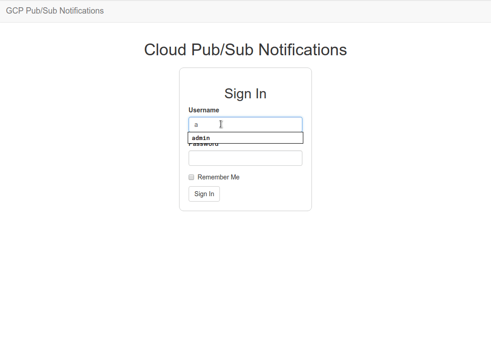

# Flask server/client application with RQ ([Redis Queue][RQ]) for asynchronous polling of a Cloud pull-subscription

This repository contains source code for a Flask application that may be used to poll and consume messages, published with Google's [Cloud Pub/Sub][GCPubSub]. To create a working example messages published from [Cloud Build][GCB] service have been used, but this is only for the proof-of-concept, as similar procedure could be used for other Pub/Sub topics and subscriptions. [Heroku][] [dynos][] have been used as a remote-staging environment, utilizing the free-tier, with one web dyno and one worker dyno, allowing hosting of the application together with a single `rq` worker.

The application can listen for new messages on a subscription created in a GCP project. When a new message is received it is stored in the database as a JSON string and also displayed in the current user's view (client side). [Bootstrap][] ([Flask-Bootstrap][flbstrp]), JavaScript, [JQuery][] and plugins ([Infinite-Scroll][infscrl]) have been used on the client-side to make the user experience more interesting. On the server-side, [SQLite][] has been used for the local development, while [PostgreSQL][] and [Gunicorn][] for Heroku deployment. RQ was chosen instead of [Celery][] as a lighter solution, but one could similarly use Celery instead of RQ. There is also another task-queue, [`psq`][PSQ], which is a Cloud Pub/Sub Task Queue for Python, developed by Google for this purpose. This is not an official product and is still in development, so RQ was chosen instead of `psq`.



## Usage

The project has been developed in a Python `virtualenv` created and managed using [`pipenv`][pipenv]. It also adds/removes packages from your `Pipfile` as you install/uninstall packages and generates the  Pipfile.lock, which is used to produce deterministic builds. You will need `pipenv` to be able to quickly and reliably reproduce a working environment to run the app locally. If you are unfamiliar with `pipenv` have a look at a few [quick tips][cliPipenv] to get you started.

You need to have a working GCP project, [setup with Pub/Sub API][pubsubsetup], and a service account to get your [`GOOGLE_APPLICATION_CREDENTIALS`][clientLibs] key file. You then need to [create a topic and a subscription][pubsubtopic].

Clone the repo and then `cd` in the project's root directory (e.g. `gcpubsub`) then create `virtualenv` and install dependencies:

```bash
git clone https://github.com/chrisliatas/pubsub-monitor.git gcpubsub
cd gcpubsub
pipenv install
```

This will install all project dependencies. Please note that the project is built using Python 3.7. When installing of all requirements is finished you will have a new `virtualenv` for the application that you can work-on by running:

```bash
pipenv shell
```

You will need to have your new `virtualenv` activated. You then have to:

```bash
export FLASK_APP=gcpubsub.py
export GOOGLE_APPLICATION_CREDENTIALS=path_to_key_file.json
export GCP_PROJECT_ID=your_GCP_project_name
export PUBSUB_TOPIC=your_pubsub_topic_name
export SUBSCRIPTION_NAME=your_subscription_name
```

Start a separate terminal in the same directory, activate your `virtualenv` (`pipenv shell`) and run:

```bash
rq worker gcpubsub-tasks

# You will get an output similar to:
09:16:13 RQ worker 'rq:worker:host-01.30454' started, version 0.12.0
09:16:13 *** Listening on gcpubsub-tasks...
09:16:13 Cleaning registries for queue: gcpubsub-tasks
```

On your first terminal run:

```bash
flask deploy
flask run
```

You should be able now, to view the application at `http://localhost:5000`. The application has a default **user** `admin` with **password** `cannotguess`, created by `flask deploy` command, that you can use for your initial login. You only need to run `flask deploy` for your first run. The default password can be changed after you login, from within the web interface.

Clicking on `Start polling` will initiate the background task that listens for messages in your subscription. If you have any messages, these will be loaded and displayed as soon as they are received. You can use the `publish.py` under the directory `helpers` if you need to create and publish sample messages to test the app.

## Would you like to learn more?

If you would like to know more about the app, usage considerations, Heroku deployment and alternatives, have a look at the post:

[Flask + RQ: Async polling a Cloud subscription][cligcpubsub]

## Dependencies

This app has been developed utilizing the following open source projects and libraries:

| Dependency  | License |
| :------------- | :------------- |
| [github.com/metafizzy/infinite-scroll](https://github.com/metafizzy/infinite-scroll) | GNU GPL license v3 |
| [github.com/miguelgrinberg/microblog](https://github.com/miguelgrinberg/microblog) | MIT License |

## License

This work is released under the [Apache License, Version 2.0](http://www.apache.org/licenses/LICENSE-2.0).


[RQ]: http://python-rq.org/
[GCPubSub]: https://cloud.google.com/pubsub/
[GCB]: https://cloud.google.com/cloud-build/
[Heroku]: https://www.heroku.com/
[dynos]: https://www.heroku.com/dynos
[Bootstrap]: https://getbootstrap.com/docs/3.3/
[flbstrp]: https://pythonhosted.org/Flask-Bootstrap/
[JQuery]: https://jquery.com/
[infscrl]: https://infinite-scroll.com/
[SQLite]: https://www.sqlite.org/
[PostgreSQL]: https://www.postgresql.org/
[Gunicorn]: https://gunicorn.org/
[Celery]: http://www.celeryproject.org/
[PSQ]: https://github.com/GoogleCloudPlatform/psq
[pipenv]: https://github.com/pypa/pipenv
[cliPipenv]: https://liatas.com/posts/anaconda-vs-pyenv-pipenv/
[pubsubsetup]: https://cloud.google.com/pubsub/docs/quickstart-cli
[clientLibs]: https://cloud.google.com/pubsub/docs/quickstart-client-libraries
[pubsubtopic]: https://cloud.google.com/pubsub/docs/quickstart-client-libraries/#create-topic-sub
[cligcpubsub]: https://liatas.com/posts/flask-gc-pubsub/
